# 🧾 PRD — Orbbit Onchain Invoice Financing Protocol (Base Buildathon #002)

## 1. Overview

**Product Name:** Orbbit Onchain Invoice Financing Protocol  
**Track:** Builder Track — Base Buildathon #002  
**Owner:** Jian Ruan (CTO, Orbbit)  
**Date:** October 2025  
**Version:** v1.0

### Summary

**One-liner:** Invoice financing marketplace where investors fund SMB invoices with USDC and earn yield on real-world receivables.

Orbbit creates a marketplace connecting investors seeking stable yields with SMBs needing fast working capital. Investors browse tokenized invoices on Base, fund them with USDC, and automatically receive principal + yield when invoices are repaid. SMBs get 80% of invoice value in under 24 hours without touching crypto.

This project bridges **real-world SMB cashflow** and **onchain capital markets**, creating a transparent, instant-settlement invoice financing platform.

---

## 2. Problem Statement

### For SMBs

Small and medium-sized businesses (SMBs) face long payment cycles (Net-30/60/90) that lock up working capital. A $50K invoice due in 60 days means they can't pay employees, buy inventory, or take new contracts.

**Traditional invoice factoring problems:**

- **Slow:** 5-7 day approval process
- **Expensive:** 15-30% annualized fees
- **Opaque:** Hidden fees, unclear pricing
- **Limited access:** Only available to larger SMBs with banking relationships

### For Investors

Crypto investors want stable yields on USDC but have limited options:

- DeFi yields are volatile and risky
- Traditional finance won't accept crypto/
- **SMB credit market ($1.5T) is completely inaccessible** - traditionally institutional-only

**What investors want:**

- 8-12% predictable APY backed by real-world assets
- Transparent risk metrics
- Instant settlement and liquidity
- Direct access without intermediaries

### The Gap

There's no bridge connecting USDC liquidity to SMB invoice financing. Orbbit creates this bridge onchain.

---

## 3. Value Proposition

### For Investors

- **8-12% APY on USDC** - predictable yield on stablecoins
- **Real-world asset backing** - invoices from verified businesses to established customers
- **Transparent risk metrics** - see invoice amount, due date, payer, risk score before funding
- **Instant settlement** - receive principal + yield immediately when invoice is repaid
- **Direct access** - invest in individual invoices, choose your own risk level
- **Portfolio diversification** - spread investments across multiple invoices/industries

### For SMBs

- **Fast capital access** - receive 80% of invoice value in <24 hours
- **Lower cost** - 10-15% annualized vs. 15-30% traditional factoring
- **No blockchain knowledge needed** - simple web interface, bank account in/out
- **Transparent pricing** - know exactly what you're paying upfront
- **Non-recourse** - if payer doesn't pay, Orbbit handles collections (not SMB's problem)

### Why Onchain?

- **Instant settlement** - automatic distribution when invoice is paid (no 5-7 day bank processing)
- **Transparent pricing** - all fees and yields are visible and verifiable
- **Global capital access** - any wallet with USDC can invest (vs. traditional factoring limited to local banks)
- **Automated repayment** - yield distribution happens automatically, no manual wire transfers
- **Reduced intermediaries** - smart contracts enforce terms, reducing operational costs

---

## 4. Success Metrics

### Hackathon Requirements (Must-Have)

| Requirement             | Our Implementation                                          |
| ----------------------- | ----------------------------------------------------------- |
| Built on Base           | ✅ All contracts deployed on Base testnet                   |
| Functioning onchain app | ✅ Live app at orbbit-invoicefi.vercel.app (or similar)     |
| Open-source GitHub repo | ✅ Public repo with contracts + frontend                    |
| 1+ transactions on Base | ✅ Mint invoice → Fund → Distribute yield (3+ transactions) |
| Video (1+ min)          | ✅ 90-sec demo: investor journey start to finish            |
| Functions as pitched    | ✅ Complete investor workflow: browse → fund → earn yield   |

### Product Success Metrics

| Metric                     | Target                                                |
| -------------------------- | ----------------------------------------------------- |
| Invoices tokenized         | 3-5 real invoices from Orbbit's SMB customers         |
| Unique investor wallets    | 10+ different wallets fund at least one invoice       |
| Average funding time       | <24 hours from invoice posted to fully funded         |
| End-to-end cycle completed | ✅ Upload → Fund → Simulate repayment → Yield paid    |
| Demo video clarity         | Non-crypto person can understand value prop in 90sec  |
| Mobile responsiveness      | Dashboard works on phone (50% of crypto users mobile) |

### Evaluation Criteria Alignment

| Criterion        | How We Meet It                                                                   |
| ---------------- | -------------------------------------------------------------------------------- |
| **Onchain**      | 100% on Base - all logic in smart contracts                                      |
| **Technicality** | Working contracts + frontend, real USDC, real invoices                           |
| **Originality**  | Transparent SMB invoice marketplace with direct investor access                  |
| **Viability**    | Clear customers: crypto investors + Orbbit's existing 500+ SMBs                  |
| **Specific**     | Focused alpha: investor workflow only, no scope creep                            |
| **Practicality** | Live demo anyone can use with Base testnet USDC                                  |
| **Wow Factor**   | Real invoices, real yields, instant settlement backed by actual business revenue |

---

## 5. Target Users

### Primary: Investors (Wallet Holders)

**Profile:** Crypto-native users with USDC seeking stable yields

- **Experience level:** Comfortable connecting wallets, using DeFi protocols
- **Portfolio size:** $5K - $500K in stablecoins
- **Risk appetite:** Low to moderate - want real-world asset backing
- **Time horizon:** Willing to lock capital for 30-90 days
- **Current behavior:** Using Aave, Compound, or just holding USDC earning 0%
- **Key motivations:**
  - Diversify into real-world assets
  - Earn predictable yield vs. volatile DeFi
  - Direct access to previously institutional-only market

### Secondary: SMBs (Abstracted from Blockchain)

**Profile:** B2B service companies needing working capital

- **Company size:** $500K - $5M annual revenue
- **Industry:** SaaS, consulting, agencies, professional services
- **Invoice profile:** Invoicing established enterprise customers (Fortune 5000) on Net-30/60 terms
- **Pain point:** Cash flow gaps between delivering service and getting paid
- **Technical literacy:** Low - prefer email/web interface, no crypto knowledge
- **Key motivations:**
  - Access capital faster than traditional factoring
  - Lower cost than existing options
  - Simple application process

---

## 6. Core Features (Investor-First Workflow)

### 6.1. Invoice Marketplace Dashboard

**User:** Investors
**What:** Browse available invoices ready for funding

- View all active invoices with key metrics displayed
- Filter by amount, due date, risk score, industry
- See funding progress (how much already funded)
- Each invoice card shows:
  - Invoice amount & funded %
  - APY (based on fee & time to maturity)
  - Days until due date
  - Payer company (e.g., "Microsoft", "Salesforce")
  - Risk score (Low/Medium/High)

### 6.2. One-Click Funding

**User:** Investors
**What:** Deposit USDC to fund specific invoices

- Connect wallet via RainbowKit (Base network)
- Approve USDC spending (one-time)
- Enter amount to invest in specific invoice
- Transaction confirms on Base
- Real-time update of funding progress

#### Funding Pool Mechanics Flowchart


### 6.3. Portfolio Tracking Dashboard

**User:** Investors
**What:** Monitor active investments and returns

- View all funded invoices
- See total invested, current value, expected return
- Track repayment status (pending/repaid)
- Display realized vs. unrealized gains
- Transaction history

### 6.4. Automated Yield Distribution

**User:** Investors
**What:** Receive principal + yield when invoice is repaid

- Smart contract automatically distributes funds when invoice is paid
- Each investor receives proportional share based on funding amount
- USDC sent directly to investor wallet
- No manual claim needed (push-based, not pull-based)
- For hackathon: simulated repayment to demonstrate flow

### 6.5. Investor User Journey Flow


### 6.6. Invoice Tokenization (Backend - ERC-721)

**User:** Orbbit admin (abstracted from SMBs)
**What:** Convert invoices to onchain assets

- Admin uploads invoice data (amount, due date, payer, etc.)
- System mints `InvoiceNFT` on Base with metadata
- Invoice becomes tradeable/fundable onchain
- For alpha: Orbbit curates invoices from existing SMB customers

### 6.7. Invoice Lifecycle State Machine

```mermaid
stateDiagram-v2
    [*] --> Created: Admin mints InvoiceNFT

    Created --> Listed: Invoice posted to marketplace

    Listed --> PartiallyFunded: First investor deposits USDC
    PartiallyFunded --> PartiallyFunded: More investors contribute

    PartiallyFunded --> FullyFunded: 100% funding reached
    Listed --> FullyFunded: Single investor funds entirely

    FullyFunded --> Disbursed: Orbbit pays SMB (80% of value)

    Disbursed --> PendingRepayment: Waiting for due date

    PendingRepayment --> Repaid: SMB repays on time
    PendingRepayment --> Overdue: Due date passes without payment

    Repaid --> YieldDistributed: Smart contract distributes<br/>principal + yield to investors

    Overdue --> UnderCollection: Orbbit initiates collection
    UnderCollection --> Repaid: Payment recovered
    UnderCollection --> Defaulted: Collection fails

    YieldDistributed --> [*]: Lifecycle complete ✓
    Defaulted --> [*]: Loss handled by Orbbit

    note right of Created
        Invoice metadata stored:
        - Amount, due date, payer
        - Risk score, APY
    end note

    note right of FullyFunded
        Triggers automatic:
        - USDC → USD conversion
        - Wire to SMB bank
    end note

    note right of YieldDistributed
        Each investor receives:
        Principal × (1 + APY × days/365)
        Proportional to their funding share
    end note
```



**State Transitions:**

1. **Created → Listed**: Invoice verified and ready for investment
2. **Listed → PartiallyFunded**: Funding begins
3. **PartiallyFunded → FullyFunded**: Target amount reached
4. **FullyFunded → Disbursed**: SMB receives working capital
5. **Disbursed → PendingRepayment**: Waiting for invoice due date
6. **PendingRepayment → Repaid**: SMB pays on time (success path)
7. **Repaid → YieldDistributed**: Investors receive returns automatically
8. **PendingRepayment → Overdue → UnderCollection**: Late payment handling

---

## 7. SMB Workflow (Blockchain Abstracted)

**Key principle:** SMBs never touch crypto, wallets, or know blockchain exists.

### Current State (Alpha - Manual)

1. **SMB applies** - Sends invoice to Orbbit via email or web form
2. **Orbbit verifies** - Confirms invoice is real, payer is legitimate
3. **Orbbit mints NFT** - Creates token on SMB's behalf (custodial wallet)
4. **Invoice goes live** - Appears on investor marketplace
5. **Investors fund** - USDC flows into smart contract
6. **Orbbit pays SMB** - Converts USDC → USD, sends to SMB's bank account
7. **SMB repays** - Pays Orbbit back via bank transfer at due date
8. **Orbbit distributes yield** - Converts USD → USDC, smart contract pays investors

**SMB's perspective:** Submit invoice → Get USD in bank account → Repay USD to bank account

**What SMB never does:**

- Create a wallet
- Buy crypto
- Sign transactions
- See blockchain

### SMB Workflow Sequence Diagram

```mermaid
sequenceDiagram
    actor SMB as SMB Company
    participant Orbbit as Orbbit Platform
    participant Blockchain as Base Network<br/>(Smart Contracts)
    participant Investors as Investors

    Note over SMB,Investors: Day 1: Invoice Submission & Tokenization

    SMB->>Orbbit: Submit invoice via email/web form<br/>(Invoice #1234, $50K, Net-60)
    activate Orbbit
    Orbbit->>Orbbit: Verify invoice authenticity<br/>& payer creditworthiness
    Orbbit->>Blockchain: Mint InvoiceNFT with metadata<br/>(amount, due date, risk score)
    activate Blockchain
    Blockchain-->>Orbbit: NFT minted, tokenId: 1234
    deactivate Blockchain
    Orbbit->>Blockchain: List invoice on marketplace
    deactivate Orbbit

    Note over SMB,Investors: Day 1-2: Funding Phase

    Investors->>Blockchain: Browse marketplace
    Investors->>Blockchain: Deposit USDC to FundingPool<br/>(Multiple investors fund $50K total)
    activate Blockchain
    Blockchain->>Blockchain: Track investor shares<br/>& funding progress
    Blockchain-->>Investors: Funding confirmed
    deactivate Blockchain

    Note over SMB,Investors: Day 2: SMB Payment

    Blockchain->>Orbbit: Funding complete event emitted
    activate Orbbit
    Orbbit->>Orbbit: Convert USDC → USD<br/>($50K × 80% = $40K)
    Orbbit->>SMB: Wire $40K to bank account
    SMB-->>Orbbit: Payment received ✓
    deactivate Orbbit

    Note over SMB,Investors: Day 60: Invoice Due & Repayment

    SMB->>Orbbit: Repay $50K + fee via bank transfer
    activate Orbbit
    Orbbit->>Orbbit: Convert USD → USDC<br/>($50K + yield)
    Orbbit->>Blockchain: Trigger repayment function<br/>with USDC
    activate Blockchain
    Blockchain->>Blockchain: Calculate yield distribution<br/>based on investor shares
    Blockchain->>Investors: Auto-distribute USDC<br/>(Principal + Yield)
    Investors-->>Blockchain: Payment received ✓
    deactivate Blockchain
    deactivate Orbbit

    Note over SMB,Investors: Complete: SMB got working capital, Investors earned yield
```



### Future State (Self-Service)

- SMB connects bank account (Plaid)
- Orbbit auto-detects unpaid invoices
- SMB clicks "Get funded" on specific invoice
- Rest is same as above

---

## 8. MVP Scope (3-Week Timeline: Oct 5 - Oct 24)

### ✅ In Scope for Alpha

**Week 1: Smart Contracts (Oct 5-11)**

- InvoiceNFT contract (ERC-721) - mint invoices with metadata
- FundingPool contract - accept USDC deposits, track investors, distribute yields
- Simulated repayment function (admin-triggered for demo)
- Deploy to Base testnet
- Write basic tests

**Week 2: Frontend Dashboard (Oct 12-18)**

- Invoice marketplace page - display 3-5 real invoices from Orbbit customers
- Wallet connection (RainbowKit + Wagmi)
- Fund invoice flow - approve USDC, deposit, see funding progress
- Portfolio page - view funded invoices, track returns
- Responsive design (mobile-friendly)

**Week 3: Integration & Polish (Oct 19-24)**

- Connect frontend to Base testnet contracts
- Add real invoice data (sanitized from Orbbit's existing SMBs)
- Simulate complete funding → repayment → yield distribution cycle
- Record demo video (<90 seconds showing investor journey)
- Deploy frontend to Vercel
- Write documentation

### ❌ Cut from Alpha (Post-Hackathon)

**Infrastructure:**

- IPFS storage for invoices (use centralized DB with IPFS hash placeholder)
- Real-time risk scoring API (use static mock scores: Low/Medium/High)
- Fiat on/off-ramp integration (assume investors already have USDC)

**Features:**

- SMB self-service onboarding (Orbbit uploads invoices manually)
- Fractionalized ERC-20 shares (each invoice = single funding pool)
- Secondary market trading
- Basename/Smart Wallet integration (nice-to-have if time permits)
- Oracle for invoice verification
- Automated collections/default handling

**Reason for cuts:** Focus on core investor flow working perfectly. Better to have 5 features working flawlessly than 15 features half-built.

### 🎯 Success Criteria for Alpha

1. ✅ 3-5 real invoices tokenized on Base testnet
2. ✅ Investor can fund invoice with USDC end-to-end
3. ✅ Admin can simulate repayment, investors receive yield
4. ✅ Demo video shows complete cycle in <90 seconds
5. ✅ Open-source repo on GitHub
6. ✅ Deployed app at public URL

---

## 9. System Architecture

### High-Level Flow (Investor-First)


### Smart Contract Architecture

```mermaid
graph TB
    subgraph "External Tokens"
        USDC[USDC Token<br/>ERC-20<br/>Base Network]
    end

    subgraph "Orbbit Smart Contracts"
        Factory[InvoiceFactory.sol<br/>━━━━━━━━━━━<br/>+ createInvoice<br/>+ setFundingPool<br/>+ owner: address]

        NFT[InvoiceNFT.sol<br/>ERC-721<br/>━━━━━━━━━━━<br/>+ invoiceAmount: uint256<br/>+ dueDate: uint256<br/>+ payer: string<br/>+ riskScore: uint8<br/>+ status: enum<br/>━━━━━━━━━━━<br/>+ mint<br/>+ updateStatus]

        Pool[FundingPool.sol<br/>━━━━━━━━━━━<br/>+ totalFunded: mapping<br/>+ investorShares: mapping<br/>+ invoiceStatus: mapping<br/>━━━━━━━━━━━<br/>+ depositUSDC<br/>+ calculateYield<br/>+ distributeYield<br/>+ withdrawInvestment]
    end

    subgraph "External Actors"
        Admin[Orbbit Admin<br/>Mints invoices]
        Investor[Investors<br/>Fund with USDC]
    end

    Admin -->|calls| Factory
    Factory -->|mints| NFT
    Factory -.->|references| Pool

    Investor -->|deposits USDC| Pool
    Pool -->|tracks ownership of| NFT
    Pool <-->|transfers| USDC

    Pool -->|distributes USDC to| Investor
    Admin -->|triggers repayment| Pool

    classDef contract fill:#e1f0ff,stroke:#333,stroke-width:2px
    classDef token fill:#fff4e1,stroke:#333,stroke-width:2px
    classDef actor fill:#e1f5e1,stroke:#333,stroke-width:2px

    class Factory,NFT,Pool contract
    class USDC token
    class Admin,Investor actor
```



**Key Relationships:**

- **InvoiceFactory** → **InvoiceNFT**: Factory creates new invoice tokens
- **FundingPool** → **USDC**: Pool handles all USDC deposits and distributions
- **FundingPool** → **InvoiceNFT**: Pool tracks which invoices are funded and their status
- **Investors** → **FundingPool**: Investors deposit USDC to fund specific invoices
- **Orbbit Admin** → **FundingPool**: Admin triggers repayment after SMB pays

### Onchain vs Backend Logic Separation

This hybrid architecture combines the transparency and trustlessness of blockchain with the speed and flexibility of traditional backends.

#### 🔗 What Goes Onchain (Smart Contracts on Base)

**Core Financial Operations**

- **USDC Deposit Tracking** - Record every investor deposit with `investorShares` mapping
- **Funding Pool Management** - Track `totalFunded` per invoice, enforce funding caps
- **Automated Yield Distribution** - Calculate proportional shares and distribute principal + yield
- **Instant Settlement** - Push-based payouts when invoice is repaid (no manual claims)

**Invoice Tokenization**

- **ERC-721 Minting** - Each invoice becomes a unique NFT with immutable metadata
- **Status Tracking** - Invoice lifecycle states (Created → Listed → Funded → Repaid)
- **Ownership Records** - Transparent proof of which invoices are funded by whom

**Transparency & Trust**

- **Investor Share Calculations** - Anyone can verify their exact percentage ownership
- **APY Calculations** - Yield formulas are auditable on-chain
- **Event Emissions** - `FundingReceived`, `InvoiceRepaid`, `YieldDistributed` events
- **State Transitions** - Prevent double-funding, enforce business rules in code

**Why Onchain:** Investors need transparent, trustless proof of where their USDC goes and that yield will be distributed fairly.

#### 💻 What Goes in Backend (NestJS/Node.js)

**SMB Abstraction Layer**

- **Invoice Upload & Intake** - Email/web form submission, PDF parsing
- **Document Verification** - Check invoice authenticity, validate payer exists
- **Business Logic** - Approval workflows, invoice enrichment, metadata extraction
- **Credit Assessment** - API calls to credit bureaus, payment history analysis

**Fiat On/Off Ramps**

- **USDC → USD Conversion** - When invoice is fully funded, convert to fiat
- **Bank Integrations** - Wire 80% of invoice value to SMB bank account (Plaid, Circle)
- **USD → USDC Conversion** - When SMB repays, convert back to USDC for distribution
- **Treasury Management** - Manage liquidity buffers, currency risk

**Risk Scoring Engine**

- **Real-time Risk Calculation** - Aggregate payer credit scores, industry trends, invoice history
- **Machine Learning Models** - Predict default probability based on historical data
- **Dynamic Risk Updates** - Adjust scores without redeploying smart contracts
- **External Data Integration** - Pull from Dun & Bradstreet, Experian, proprietary sources

**User Management & Auth**

- **SMB Accounts** - Email/password auth, profile management, KYC/KYB verification
- **Investor Accounts** - Wallet address linking, notification preferences
- **Session Management** - JWT tokens, refresh flows, OAuth integration
- **Permissions & Roles** - Admin, SMB, investor access control

**Database & Search**

- **Invoice Metadata Storage** - Rich details (payer name, industry, contract terms)
- **Search & Filtering** - Fast queries by APY, amount, due date, risk level
- **User Preferences** - Saved searches, watchlists, investment history
- **Analytics & Reporting** - Portfolio performance, platform metrics, trend analysis

**Collections & Default Handling**

- **Overdue Tracking** - Monitor invoices past due date
- **Automated Reminders** - Email/SMS to SMBs with upcoming payments
- **Collections Workflow** - Escalation paths, legal process management
- **Loss Provisioning** - Reserve fund calculations, investor protections

**Why Backend:** Flexibility to update business logic, privacy for sensitive data, cost-effective for frequent operations.

#### 📊 Decision Matrix: Onchain vs Backend

| Requirement                  | Onchain (Smart Contracts) | Backend (NestJS/Node.js) |
| ---------------------------- | ------------------------- | ------------------------ |
| **Transparency Required?**   | ✅ All logic visible      | ❌ Black box to users    |
| **Trust Minimization?**      | ✅ Immutable, auditable   | ❌ Requires trust        |
| **Financial Transactions?**  | ✅ USDC deposits/yields   | ❌ Metadata only         |
| **Speed Critical?**          | ❌ 2-5 sec finality       | ✅ Instant reads (<50ms) |
| **Cost Per Operation**       | ❌ $0.01-0.10 per tx      | ✅ Nearly free           |
| **Privacy Needed?**          | ❌ All public on-chain    | ✅ Keep data private     |
| **Frequent Updates?**        | ❌ Hard to upgrade        | ✅ Deploy changes daily  |
| **Complex Computations?**    | ❌ Gas expensive          | ✅ Run ML models         |
| **External API Calls?**      | ❌ No HTTP in Solidity    | ✅ Call any API          |
| **Regulatory Compliance?**   | ❌ Pseudonymous only      | ✅ Full KYC/KYB          |

**Rule of Thumb:** If investors need to trust it, put it onchain. If it's operational/administrative, keep it in backend.

#### 💡 Real Example: $50K Invoice Funding Flow

**Scenario:** Investor deposits $5K to partially fund a $50K invoice. Let's see how both layers work together.

**Step 1: Investor Deposits USDC (Onchain)**

```solidity
// Smart Contract: FundingPool.sol
function depositUSDC(uint256 invoiceId, uint256 amount) external {
    require(invoices[invoiceId].status == Status.Listed, "Not available");
    require(totalFunded[invoiceId] + amount <= invoices[invoiceId].amount, "Exceeds target");

    // Transfer USDC from investor to contract
    usdc.transferFrom(msg.sender, address(this), amount);

    // Track investor's share
    investorShares[invoiceId][msg.sender] += amount;
    totalFunded[invoiceId] += amount;

    emit FundingReceived(invoiceId, msg.sender, amount, totalFunded[invoiceId]);

    // Check if fully funded
    if (totalFunded[invoiceId] == invoices[invoiceId].amount) {
        invoices[invoiceId].status = Status.FullyFunded;
        emit InvoiceFullyFunded(invoiceId, totalFunded[invoiceId]);
    }
}
```

**Result:**
- Investor's wallet: -5000 USDC
- Contract holds: +5000 USDC
- `investorShares[1234][0xInvestor]` = 5000
- `totalFunded[1234]` = 45000 → 50000
- Event emitted: `FundingReceived(1234, 0xInvestor, 5000, 50000)`

**Step 2: Backend Listens for Full Funding (Backend)**

```typescript
// Backend: invoice-listener.service.ts (NestJS)
@Injectable()
export class InvoiceListenerService {
  constructor(
    private readonly circleApi: CircleApiService,
    private readonly plaidService: PlaidService,
    private readonly emailService: EmailService,
    private readonly prisma: PrismaService,
  ) {}

  @OnEvent('InvoiceFullyFunded')
  async handleFullyFundedInvoice(event: InvoiceFullyFundedEvent) {
    const { invoiceId, totalFunded } = event;

    // 1. Fetch invoice details from DB
    const invoice = await this.prisma.invoice.findUnique({
      where: { onchainId: invoiceId },
      include: { smb: true },
    });

    // 2. Convert USDC → USD via Circle API
    const usdAmount = await this.circleApi.convertToUSD({
      amount: totalFunded, // 50000 USDC
      currency: 'USD',
    });

    // 3. Calculate SMB payout (80% of invoice value)
    const payoutAmount = usdAmount * 0.8; // $40,000

    // 4. Initiate wire transfer to SMB's bank account
    const wireResult = await this.plaidService.sendWire({
      accountId: invoice.smb.bankAccountId,
      amount: payoutAmount,
      description: `Invoice #${invoice.invoiceNumber} funding`,
    });

    // 5. Update database
    await this.prisma.invoice.update({
      where: { id: invoice.id },
      data: {
        status: 'DISBURSED',
        fundedAt: new Date(),
        disbursedAt: new Date(),
        wireTransferId: wireResult.transferId,
      },
    });

    // 6. Notify SMB
    await this.emailService.send({
      to: invoice.smb.email,
      subject: `Invoice #${invoice.invoiceNumber} Funded! 🎉`,
      template: 'invoice-funded',
      data: {
        amount: payoutAmount,
        invoiceNumber: invoice.invoiceNumber,
        expectedArrival: '1-2 business days',
      },
    });

    // 7. Log for audit trail
    this.logger.log(
      `Invoice ${invoiceId} disbursed: $${payoutAmount} sent to ${invoice.smb.companyName}`,
    );
  }
}
```

**Result:**
- Circle converts 50,000 USDC → $50,000 USD
- Plaid wires $40,000 to SMB bank account
- Database updated: `status = 'DISBURSED'`
- SMB receives email notification
- Backend logs transaction for compliance

**Step 3: Invoice Repayment & Yield Distribution (Hybrid)**

**Backend receives SMB repayment (60 days later):**

```typescript
// SMB repays $52,500 to Orbbit's bank account ($50K principal + $2.5K fee)
// Backend converts USD → USDC via Circle
const usdcAmount = await this.circleApi.convertToUSDC({
  amount: 52500,
  currency: 'USD',
}); // Returns 52,500 USDC

// Backend triggers smart contract repayment
const tx = await fundingPoolContract.triggerRepayment(invoiceId, usdcAmount);
```

**Onchain distributes yield automatically:**

```solidity
// Smart Contract: FundingPool.sol
function triggerRepayment(uint256 invoiceId, uint256 repaymentAmount) external onlyAdmin {
    require(invoices[invoiceId].status == Status.PendingRepayment, "Not ready");

    // Transfer USDC from admin to contract
    usdc.transferFrom(msg.sender, address(this), repaymentAmount);

    // Calculate total to distribute (includes yield)
    uint256 totalToDistribute = repaymentAmount; // $52,500 USDC
    uint256 invoiceAmount = invoices[invoiceId].amount; // $50,000

    // Iterate through all investors and distribute proportionally
    address[] memory investors = getInvestors(invoiceId);
    for (uint256 i = 0; i < investors.length; i++) {
        address investor = investors[i];
        uint256 investorShare = investorShares[invoiceId][investor];

        // Proportional payout = (investor's share / total funded) × total distribution
        uint256 payout = (investorShare * totalToDistribute) / invoiceAmount;

        // Send USDC directly to investor (push-based)
        usdc.transfer(investor, payout);

        emit YieldDistributed(invoiceId, investor, investorShare, payout);
    }

    invoices[invoiceId].status = Status.Repaid;
    emit InvoiceRepaid(invoiceId, repaymentAmount);
}
```

**Result for our $5K investor:**
- Invested: 5,000 USDC (10% of invoice)
- Receives: (5,000 / 50,000) × 52,500 = **5,250 USDC**
- Profit: 250 USDC (5% return over 60 days = ~30% APY)
- No manual claim needed - USDC sent directly to wallet

#### 🎯 Summary: Best of Both Worlds

| Layer           | Handles                                                                   | Why                                           |
| --------------- | ------------------------------------------------------------------------- | --------------------------------------------- |
| **Onchain**     | USDC deposits, investor tracking, yield distribution, transparency       | Trust, auditability, instant settlement       |
| **Backend**     | Invoice verification, risk scoring, fiat conversion, SMB interaction, KYC | Speed, privacy, flexibility, regulatory needs |
| **Integration** | Backend triggers contracts when real-world events happen (funding, repayment) | Bridge between fiat world and crypto world    |

**Key Insight:** Investors interact with a transparent, trustless onchain system. SMBs interact with a traditional fintech interface. Backend acts as the bridge, handling the messy real-world parts while keeping core financial logic onchain.

### Tech Stack

**Smart Contracts (Base)**

- Language: Solidity 0.8.x
- Frameworks: Hardhat or Foundry
- Contracts:
  - `InvoiceNFT.sol` (ERC-721) - tokenize invoices
  - `FundingPool.sol` - manage USDC deposits, track investors, distribute yields
  - `InvoiceFactory.sol` - mint new invoices
- Testing: Hardhat tests, Base testnet deployment

**Frontend (Next.js)**

- Framework: Next.js 14 (App Router)
- Styling: TailwindCSS
- Web3: Wagmi v2 + Viem
- Wallet: RainbowKit (Base network)
- Deployment: Vercel

**Backend (For Alpha - Centralized)**

- Database: PostgreSQL (Supabase) - store invoice metadata
- Storage: Centralized DB (IPFS placeholder for future)
- Admin API: Next.js API routes for minting invoices

**Base Integration**

- Network: Base Sepolia (testnet)
- Token: USDC (Base testnet)
- RPC: Base public RPC or Alchemy

---

## 10. Why This Wins the Hackathon

### Unique Differentiation

We're solving a real business problem: SMBs need faster access to working capital, and investors want transparent yields backed by real assets.

**What makes this different:** Investors can see exactly what they're funding (Invoice to Microsoft for $50K, due in 60 days, 10% APY) with full transparency - something impossible in traditional factoring or DeFi lending pools.

### Market Opportunity

- **$1.5 trillion SMB invoice market** currently locked in opaque, expensive factoring
- **Orbbit already has 500+ SMB customers** with real invoices - we can launch with actual data
- **Real business revenue** - investors earn yield from companies paying their bills, backed by actual business operations

### Why Base is Essential

- **Instant settlement** - yield distributed in seconds when invoice is repaid (try that with Ethereum gas fees)
- **Low cost** - small invoices ($5K-$50K) viable with Base's low transaction costs
- **USDC native** - Base's stablecoin rails make conversion seamless
- **Onchain identity ready** - Basenames perfect for investor reputation system (future)

### Technical Excellence

- **Full stack onchain** - smart contracts handle all core logic (minting, funding, distribution)
- **Real USDC flows** - not testnet tokens, actual Base USDC for authentic demo
- **Production-ready architecture** - clean separation between investor (onchain) and SMB (abstracted) layers
- **Focused scope** - one workflow done perfectly, not ten features half-built

### Viability Beyond Hackathon

This isn't a hackathon toy. We have:

- **Clear revenue model** - 2-3% platform fee on funded invoices
- **Existing customers** - Orbbit's SMB base ready to use this
- **Addressable market** - Every B2B company with Net-30/60 terms
- **Post-buildathon path** - Raise seed round, integrate real risk scoring, launch mainnet in Q1 2026

### Accessible to Mainstream Users

**SMBs don't know they're using blockchain.** They submit invoices via email, get USD in their bank account, repay USD. Zero crypto knowledge needed.

**Investors have a simple experience.** Connect wallet, deposit USDC, earn yield. No complex concepts required.

The platform solves real problems while abstracting blockchain complexity.

### What Judges Will See

The demonstration will show:

- **Live invoices** from real companies funding on Base
- **Real-time funding progress** as investors contribute
- **Instant yield distribution** when we simulate repayment
- **Transparent risk dashboard** showing exactly what backs each investment
- **90-second demo** that anyone can understand, regardless of crypto experience

Real businesses getting capital, real investors earning returns, all automated onchain.

---

## 11. Next Steps

**Week 1 (Oct 5-11):** Smart contracts deployed to Base testnet
**Week 2 (Oct 12-18):** Frontend deployed with wallet connection
**Week 3 (Oct 19-24):** Integration complete, demo video recorded
**Oct 24:** Submit to Base Buildathon #002

**Post-submission:** Early feedback from judges (Oct 10 early submission), iterate based on feedback

---

## Contact

**Team:** Orbbit
**CTO:** Jian Ruan
**Product:** Capital & financial intelligence platform for SMBs
**GitHub:** [orbbit-monorepo](https://github.com/orbbit/orbbit-monorepo)
**Website:** orbbit.com (placeholder)

---

_Built with ❤️ on Base to bring a billion users onchain, one invoice at a time._
